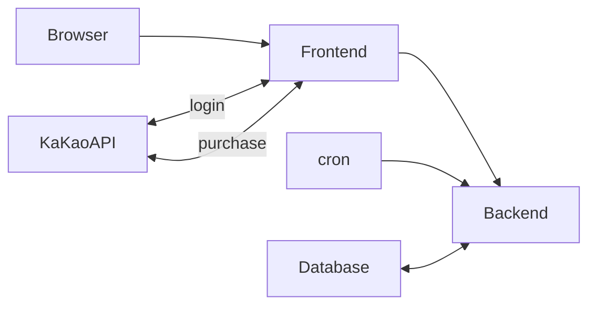
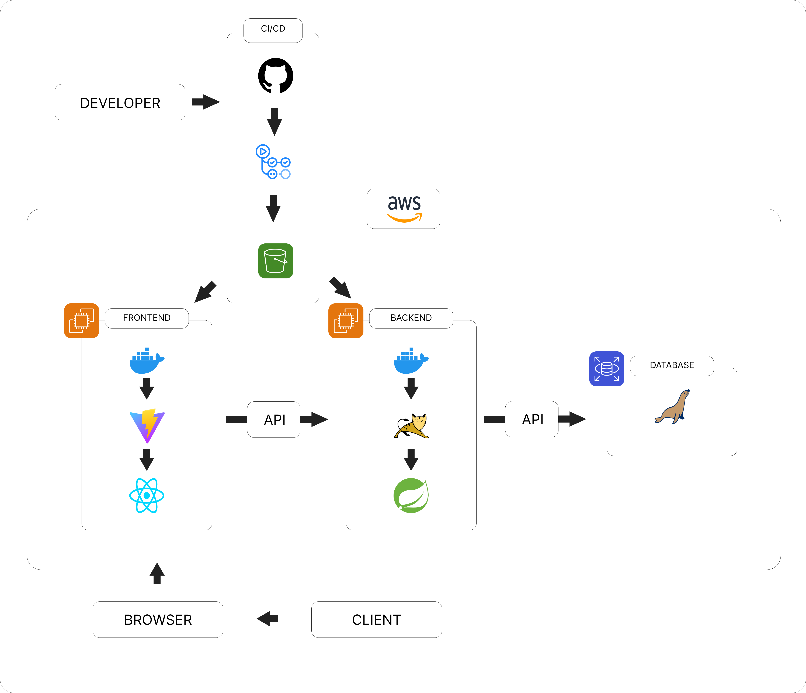

# Begin Vegan

## 주제 : 비건식당 서칭/예약/사전결제 서비스

 

 ## 요구사항 정리

 

> ## **_기본 요구 사항_**

 

### **1. 반응형 화면 구현**

- Why: 다양한 크기의 디바이스에서도 사용자에게 적절한 UI를 제공하기 위해 반응형 웹 디자인이 필요하다.
- How: HTML, CSS, JavaScript를 이용하여 디바이스 크기에 따라 자동으로 레이아웃이 조정되도록 구현한다. 미디어 쿼리를 사용하여 뷰포트 크기를 감지하고, 레이아웃을 조정하는 CSS 스타일을 적용한다.

### **2. AOP를 활용해서 메서드 접근 로그 남기기**

- Why: 메서드의 실행 시간, 호출 정보 등을 로그로 남겨 추적 가능하게 하여 디버깅이나 분석에 용이하게 하기 위해 필요하다.
- How: Spring AOP를 사용하여 공통 관심 사항(로깅)을 모듈화하고, 개발 코드와 분리한다. 메서드 실행 시점에 로깅 코드를 삽입하여 메서드 접근 로그를 남기며, 로깅 대상을 메서드, 클래스, 패키지 등으로 지정할 수 있다.

### **3. Quartz Scheduler를 이용한 배치프로그램 기능 구현**

- Why: 일정 주기로 반복되는 작업(예: DB 백업, 이메일 발송 등)을 자동으로 처리하기 위해 배치프로그램 기능이 필요하다.
- How: Quartz 라이브러리를 사용하여 스케줄링이 필요한 작업을 등록하고, 작업 실행 시점을 지정한다. 스케줄러는 설정된 주기에 따라 자동으로 작업을 수행하며, 작업의 성공/실패 여부를 로그에 남긴다.

### **4. 권한 처리: 로그인한 사용자에게 허용된 페이지 외에는 예외 처리**

- Why: 로그인한 사용자와 비로그인 사용자가 접근 가능한 페이지를 구분하여 보안을 강화하고, 권한이 없는 사용자가 접근 시 예외 처리를 함으로써 보안 문제를 방지하기 위해 필요하다.
- How: Spring Security를 사용하여 로그인 인증 후 권한이 있는 사용자만 접근 가능한 페이지에 접근할 수 있도록 구현한다. 권한이 없는 사용자가 접근 시, 예외 처리를 하여 보안 문제를 방지한다.

### **5. 파일 첨부 기능 구현, 가능하다면 멀티 파일을 압축파일로 다운로드 하는 기능 구현**

- Why: 사용자가 파일을 업로드하고 필요할 때 다운로드할 수 있는 기능을 제공하기 위해. 특히 멀티 파일을 다운로드할 때 압축파일로 다운로드하는 기능은 사용자 편의성을 높일 수 있습니다.
- How: HTML form과 enctype을 사용하여 파일을 업로드하고, 서버 측에서는 Spring의 MultipartResolver를 사용하여 파일을 처리하고 저장합니다. 파일 다운로드 시 멀티 파일이면 서버 측에서 압축파일을 생성하고 클라이언트에게 다운로드할 수 있도록 제공합니다. 이를 위해 서버에서는 ZipOutputStream 클래스를 사용하여 압축파일을 생성하고, 클라이언트에서는 브라우저에서 제공하는 다운로드 기능을 사용하여 압축파일을 다운로드할 수 있습니다.

### **6. Transaction처리 (@Transactional 사용)**

- Why: 여러 단계로 이루어진 로직 중 중간에 에러가 발생하면 이전 단계에서 이미 처리한 작업들도 모두 롤백해야 함. 이를 보장하기 위해 트랜잭션 처리가 필요함.
- How: Spring에서 제공하는 @Transactional 어노테이션을 사용하여 트랜잭션 처리를 구현할 수 있음. 이를 통해 각 메소드에 대해 트랜잭션 범위를 지정하고, 트랜잭션 처리 중 발생한 예외를 적절하게 처리할 수 있음.

### **7. 프런트엔드에서 XHR(XML Http Request) 사용이 1번 이상**

- Why: 현대의 웹 어플리케이션에서는 동적으로 데이터를 로드하거나 백엔드 API와 통신하여 데이터를 주고받는 일이 매우 중요함. 이를 위해 XHR(XML Http Request)이나 이를 대체하는 fetch, axios 등의 API를 사용하여 비동기적으로 데이터를 가져오는 일이 많음.
- How: XHR, fetch, axios 등의 API를 사용하여 백엔드 API와 통신하고, 이를 통해 동적으로 데이터를 로드하는 등의 프론트엔드 로직을 구현할 수 있음. 이때 적절한 HTTP 메소드(GET, POST, PUT, DELETE 등)를 사용하여 백엔드 API와 통신하고, 응답 결과를 처리하여 사용자에게 적절한 방식으로 보여줄 수 있음.

### **8. 테스트 코드 커버리지 결과를 확인**

- Why: 테스트 코드 커버리지 결과를 확인하면 소프트웨어가 어느 정도 테스트되었는지 측정할 수 있으며, 전체 코드 범위 중 얼마나 많은 부분이 테스트되었는지 알 수 있습니다. 이는 소프트웨어의 신뢰성을 높이고, 버그를 사전에 발견하고 수정하여 비용을 절감할 수 있습니다.

- How: 커버리지 결과를 확인하기 위해 일반적으로는 자동화된 테스트 도구를 사용합니다. JaCoCo는 코드 커버리지 분석 도구로서 테스트 코드의 실행 결과를 기반으로 커버리지 결과를 생성합니다. 이러한 도구를 사용하여 커버리지 결과를 분석하고, 커버리지가 낮은 영역을 찾아 추가적인 테스트를 수행할 수 있습니다. 이를 토대로 개선점을 도출하고 보완할 수 있습니다.

 
 

> ## **_추가 요구 사항_**

 

### **9. OAuth 로그인**

- Why : OAuth 로그인은 사용자의 ID와 비밀번호를 입력하지 않고도 다른 서비스에서 제공하는 로그인 정보를 활용해 로그인을 할 수 있도록 하는 인증 방식입니다. 이를 통해 사용자는 각각의 서비스에서 별도로 로그인하지 않아도 되며, 개발자는 사용자 인증과 관련된 기능을 별도로 구현하지 않고도 다른 서비스의 인증 정보를 활용할 수 있습니다. 이러한 이유로 OAuth 로그인은 인기 있는 로그인 방식 중 하나입니다.

- How : 구글, 카카오 등 대부분의 OAuth 제공자는 자체적으로 API를 제공하며, 이를 활용하여 손쉽게 OAuth 로그인을 구현할 수 있습니다. 자바 개발자는 Spring Security OAuth를 활용하여 OAuth 로그인을 구현할 수 있습니다. Spring Security OAuth는 OAuth 1.0, 2.0 두 가지 프로토콜을 지원하며, 각각의 제공자마다 필요한 설정을 하여 OAuth 로그인을 구현할 수 있습니다.

### **10. 지도 라이브러리**

- Why : 지도 라이브러리는 지도를 표시하고, 위치 검색, 경로 탐색 등 지리 정보를 활용한 다양한 서비스를 제공할 수 있습니다. 이를 통해 사용자에게 더 나은 서비스를 제공할 수 있으며, 지도 라이브러리를 활용하면 구현 시간을 단축할 수 있습니다.

- How : Google Maps API, Kakao Maps API, Naver Maps API 등 다양한 지도 라이브러리가 제공되며, 각각의 API를 활용하여 구현할 수 있습니다. 이러한 API는 RESTful API를 제공하며, HTTP 요청을 통해 지도 정보를 받아올 수 있습니다. 예를 들어, Kakao Maps API를 활용한다면 JavaScript SDK를 이용하여 지도를 표시할 수 있습니다.

### **11. 결제기능**

- Why : 온라인 상에서의 결제는 사용자가 물리적으로 차이나는 거래를 수행할 수 있는 기회를 제공합니다. 또한 온라인 상에서의 결제는 소비자가 상품을 더 쉽고 빠르게 구매할 수 있게 하며, 판매자는 수익을 증대시킬 수 있습니다. 따라서 온라인 서비스에서는 결제 기능이 매우 중요한 요소입니다.

- How : 카카오페이 API는 카카오페이 결제, 취소, 결제내역 조회 등의 기능을 제공합니다. 개발자가 API를 활용하여 간편한 결제 서비스를 구현할 수 있습니다. 카카오페이 API를 사용함으로써, 온라인 상에서 간편하고 안전한 결제 서비스를 제공할 수 있습니다.

 

# Infra Flow-Chart

# Service Architecture

# 기획 / 디자인
## **Figma 활용**
 
접속 URL : https://www.figma.com/file/c3Uld34o4YsqENxoiAUzNX/BeginVegan?type=design&node-id=0-1&t=27MQalCo43jBtLxc-0

# ERD

