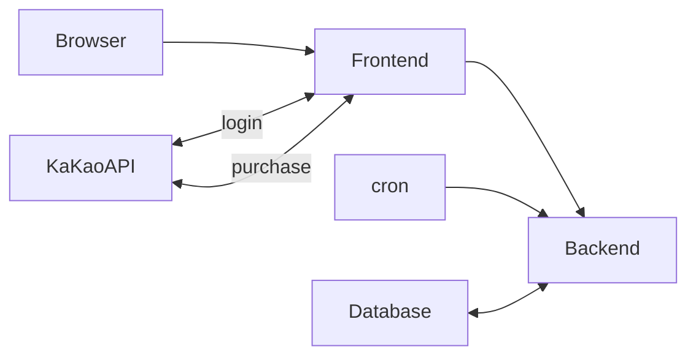

# 🥗 Begin Vegan

<br><br>

## 📄 프로젝트 소개
**주제 : 비건식당 서칭/예약/사전결제 서비스**  
**기간 : 2023.04 ~ 2023.06**  
**인원 : 4명**  

<h3>✨ 위 서비스에서 제공하는 기능 </h3>  

> 📌 이용자 관점 기능 4가지
> 1. 메뉴/인원/시간 정보 선택 후 식당 예약 및 결제
> 2. 키워드를 통한 식당 검색과 지도 기반 식당의 위치 및 주변 식당 정보 확인 
> 3. 식당 후기 댓글 및 별점 평가와 식당 즐겨찾기 기능
> 4. 마이페이지에서 포인트/예약/결제/댓글 등의 정보 확인
>
> 📌 관리자 관점 기능 3가지
> 1. 관리자 페이지에서 포인트 지급 및 권한 부여 등 회원 관리
> 2. 식당을 등록 및 메뉴 관리
> 3. 차트를 통한 전체 식당의 월별 예약 건수 발생 추이 확인
<br>

## 🛠 기술 스택


<br><br>

 ## 🖥 요구사항 정리

<br><br><br>


 > ## **_기본 요구 사항 8가지_**
 ```
 📍 1. 반응형 화면 구현
 - Why: 다양한 크기의 디바이스에서도 사용자에게 적절한 UI를 제공.
 - How: 미디어 쿼리를 사용하여 뷰포트 크기를 감지하고, 레이아웃을 조정하는 CSS 스타일을 적용한다.
 
 📍 2. 메서드 접근 로그 남기기
 - Why: 디버깅과 분석 용이성을 위해 메서드의 실행 시간, 호출 정보 등의 로그를 추적한다. 
 - How: Spring AOP로 공통 관심 사항(로깅)을 모듈화하고, 개발 코드와 분리한다.
 
 📍 3. Scheduler를 이용한 배치프로그램 기능 구현
 - Why: 일정 주기로 반복되는 작업을 자동으로 처리.
 - How: Quartz 라이브러리를 사용하여 스케줄링이 필요한 작업을 등록한다.
 
 📍 4. 권한 처리: 로그인한 사용자에게 허용된 페이지 외에는 예외 처리
 - Why: 권한이 없는 접근에 대해 예외 처리 함으로써 보안을 강화한다.
 - How: Filter를 통해 권한을 체크하여 메소드 접근을 제한하고, 또한 화면단에서 기능을 제한한다.
 
 📍 5. 파일 첨부 기능 구현, 멀티 파일을 압축파일로 다운로드 하는 기능 구현
 - Why: 파일 업/다운로드 편의성 제공.
 - How: HTML form과 Spring MultipartResolver로 파일 처리
 
 📍 6. Transaction 처리
 - Why: 오류로부터 복구를 허용하고 데이터베이스를 일관성있게 유지하는 안정적인 작업 단위를 제공한다.
 - How:  Spring의 @Transactional로 트랜잭션 범위 지정 및 예외 처리.
 
 📍 7. XHR(XML Http Request) 통신
 - Why: 동적 데이터 로드를 위한 백엔드 통신.
 - How: XHR, fetch, axios 등의 API를 사용하여 백엔드와 통신하고 동적으로 데이터를 로드하는 로직 구현.
 
 📍 8. 테스트 코드 작성, 커버리지 결과 확인
 - Why: 테스트 범위 파악 및 버그를 사전에 발견하여 수정하여 비용을 절감하고 소프트웨어의 신뢰성을 높임.
 - How: Junit5를 이용한 테스트 코드 작성 및 JaCoCo를 이용한 코드 커버리지 분석 및 개선점 도출.
 ```
 <br>
 
 > ## **_추가 요구 사항 3가지_**
 ```
 📍 9. OAuth 로그인
 - Why : 사용자는 외부 서비스의 로그인 정보로 편하게 로그인하고, 개발자는 사용자 인증 관련 기능을 간소화.
 - How : 구글, 카카오 등에서 제공하는 API를 활용하여 OAuth 로그인 구현.
 
 📍 10. 지도 라이브러리
 - Why : 지리 정보를 활용한 서비스를 제공.
 - How : Kakao Maps API와 같은 지도 라이브러리의 API를 활용하여 구현.
 
 📍 11. 결제 기능
 - Why : 결제 기능을 통한 온라인 거래 활성화 및 수익 증대.
 - How : IAMPORT API를 활용한 결제 기능 구현.
```

<br>

# Infra Flow-Chart



# Service Architecture


# 기획 / 디자인
## **Figma 활용**
<br>


접속 URL : https://www.figma.com/file/c3Uld34o4YsqENxoiAUzNX/BeginVegan?type=design&node-id=0-1&t=27MQalCo43jBtLxc-0

# ERD

